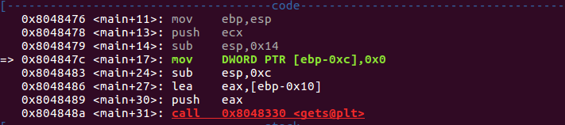
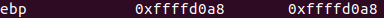
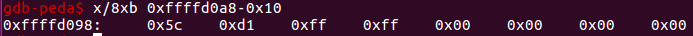
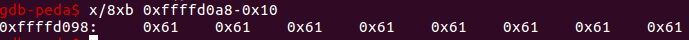
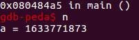

# Stack Overflow (1)

有如下代码:

```
#include <stdio.h>
#include <stdlib.h>

int main()
{
	int a = 0;
	char buf[4];
	gets(buf);
	if (a != 0)
		printf("a = %d\n", a);
	else
		printf("ooo\n");

	return 0;
}
```
**编译时使用`-fno-stack-protector`取消堆栈保护.**

使用gdb调试，看到如下汇编代码:



显然，`ebp-0xc`为变量a的地址，`ebp-0x10`为字符串buf的首地址，二者相差4字节，正好是字符数组buf的长度. 由此可知，变量a和buf在内存中是连续存放的，a的地址紧跟buf之后. 因此，在取消堆栈保护的条件下，如果使用不安全的gets，就会发生**无法被检测到的**缓冲区溢出，&a中的内容就会被覆盖.

**下面进行跟踪:**

使用`i r`命令查看寄存器的值:



查看ebp-0x10处的内存:



这是gets调用之前的情况，后面的0x00000000便是变量a的值.

倘若输入"aaaaaaaa"，则:



缓冲区溢出，a的内存区被覆盖了.
最终，程序输出为：


