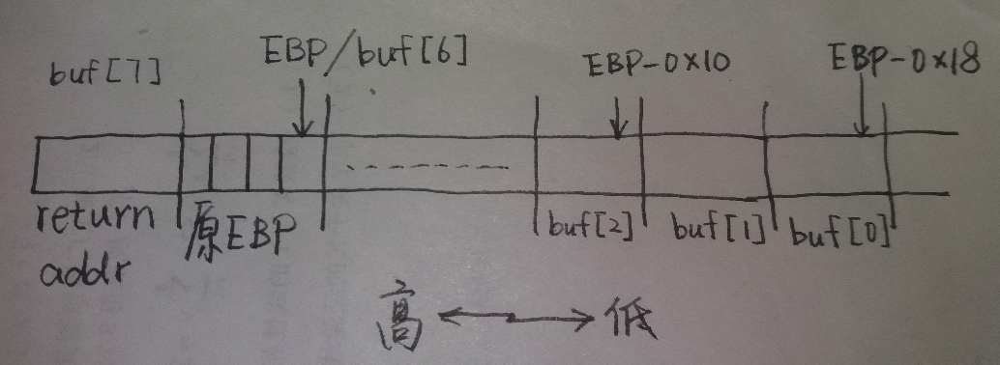
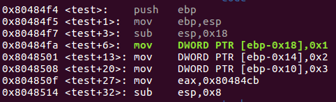
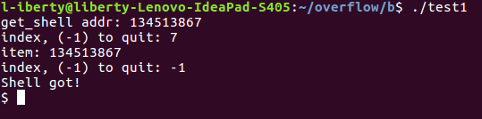

# Stack Overflow (2)

有如下溢出攻击测试代码：
```
#include <stdio.h>
#include <stdlib.h>

void get_shell()
{
	printf("Shell got!\n");
	system("/bin/sh");
}


int test()
{
	int i;
	int buf[3] = { 1, 2, 3};

	printf("get_shell addr: %d\n",(int) get_shell);
	while (1) {
		printf("index, (-1) to quit: ");
		scanf("%d", &i);
		if (i == -1) break;

		printf("item: ");
		scanf("%d", &buf[i]);
	}

	return 0;
}

int main()
{
	test();
	return 0;
}
```
编译时取消堆栈保护
`gcc test1.c -o test -fno-stack-protector -m32`

分析栈映像时应该抛开次要因素，抓重点，不必在意细节. 本例只需关注test的返回地址和buf数组在栈里的相对位置，printf和scanf的调用，以及其他地方诸如`sub esp, xx`之类的指令的分析完全没必要.

本例的栈映像：



gdb反汇编关键代码:



不难算出&buf[7]便是栈里存放test返回地址之处，只需将其覆盖为get_shell的入口地址即可:

