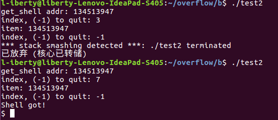
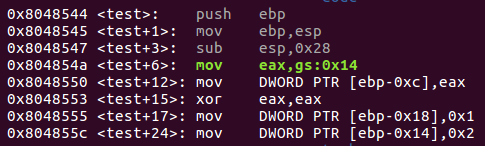
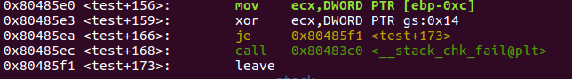

# Stack Overflow (3)

仍以b部分的代码为例，开启堆栈保护
`gcc test.c -o test2 -m32`

尝试向buf[3]和buf[7]赋值，结果如下:

向buf[3]赋值导致溢出并被检测到，向buf[7]赋值则成功拿到shell，下面通过gdb反汇编分析:

ebp-0xc处的内存紧邻buf[2]，称为溢出检测单元，该处存放一个来自gs:0x14的随机数，若向数组赋值时发生溢出就可能覆盖检测单元，程序最后比较溢出检测单元和gs:0x14处的数值，如果不相等则认为发生溢出(如下图).

但是如果回避溢出检测单元，直接覆盖返回地址，溢出攻击仍可成功.