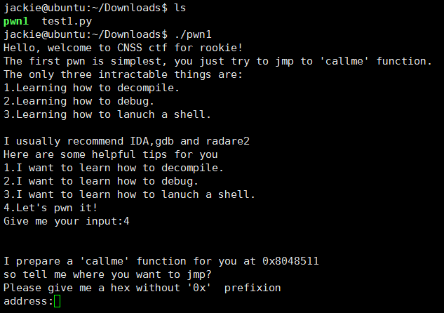
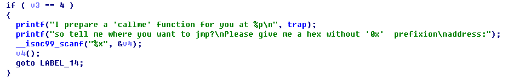
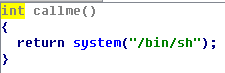
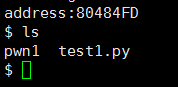
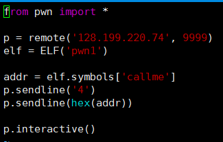
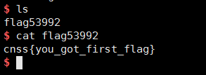

# PWN (1)
> 本题要求拿到服务器的shell，然后获得flag.

附件是一个二进制文件，使用`chmod u+x pwn1`添加执行权限后执行之：

IDA反编译，找到main函数中有如下代码段:

可以看到用户需要先输入字符'4'，之后再输入一个地址，最后执行该地址上的一个函数. 程序的提示中涉及名为'callme'的函数，容易在IDA中找到它，反编译之:

显然，若能跳转执行callme，就能拿到服务器的shell.

在IDA中可以看到callme的入口为 0x080484FD，如图所示:

尝试将80484FD作为输入，结果拿到的是本机的shell:

所以需要借助pwntools连接服务器，将字符'4'和callme的入口地址一次发送过去，因此需要一段python代码:

键入`python test1.py`执行，则可拿到服务器的shell，从而获得flag:

