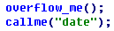
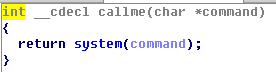
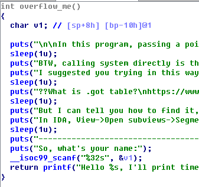
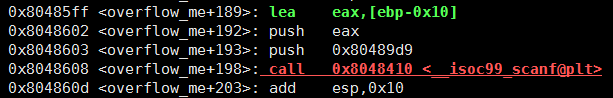
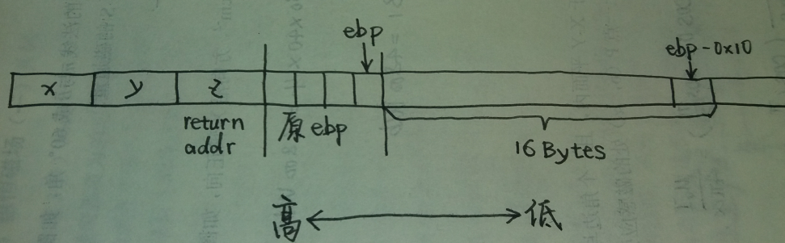
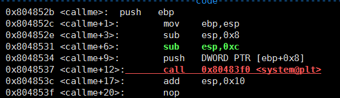
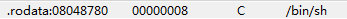
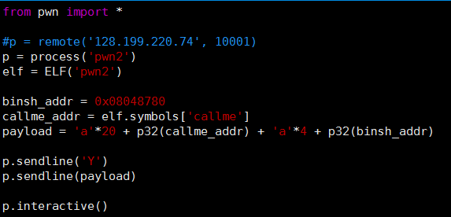
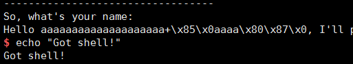

# PWN (2)
> 本题是一个简单的栈溢出攻击，要求拿到服务器的shell，已知附件二进制文件中有字符串"/bin/sh"

**用IDA反编译main函数，找到如下关键代码:**

**反编译callme:**

那末必然要在overflow_me中实现栈溢出，覆盖正确的返回地址，同时将"/bin/sh"的地址放到栈的合适位置以被callme获取，从而执行`system("/bin/sh")`拿到shell.

**反编译overflow_me:**

代码中使用了不安全的scanf，这是溢出的关键，只需获得局部变量v1在栈里的位置即可——使用gdb反汇编:

ebp-0x10便是v1的地址，画出上图时刻的栈映像:

因此需要输入 `'a'*20 + 4字节callme入口地址`，使得最后执行ret后eip被设置为callme的入口地址.

**现在需要解决的问题是如何给callme传递参数**

overflow执行ret指令时esp指向z单元，执行ret后(eip)=callme入口地址，esp指向y单元.

**gdb反汇编callme:**

执行`push ebp`时，先将esp向低地址移动一个单位(32位机上一个单位为4字节)，使esp指向z单元，然后向z单元中写入ebp的原值. `mov esp,ebp`后ebp指向z单元. `push DWORD PTR [ebp+0x8]`说明需要从ebp+0x8处获取system函数的参数，而ebp+0x8指向x单元. 因此最终的填充字节为:

`'a'*20 + 4字节callme入口地址 + 'a'*4 + "/bin/sh"的地址`

**对照栈映像图统一说明之:**

* `'a'*20` 填充 "16Bytes"和"原ebp"
* `4字节callme入口地址` 填充z单元
* `'a'*4` 填充y单元
* `"/bin/sh"的地址` 填充x单元

其中，"/bin/sh"的地址通过IDA获取:

## 完整的python代码即运行结果如下:

