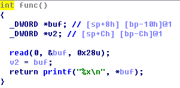
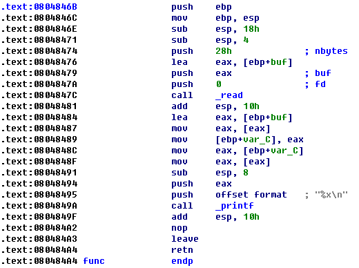
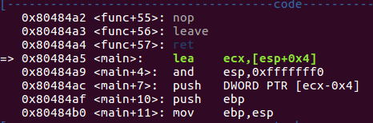
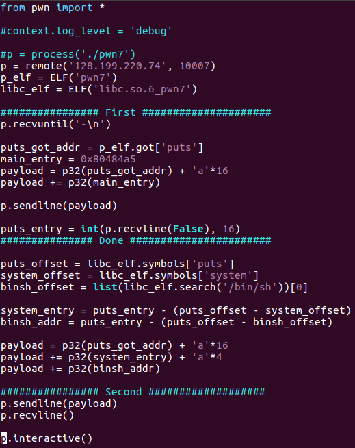
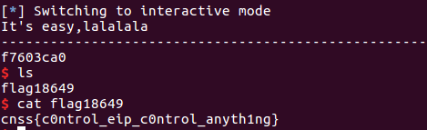

# PWN (7)

## IDA分析二进制文件

`main`函数中只调用了`func()`

反编译`func`:

反汇编`func`:

反编译结果显得很费解，对一个指针取地址，并将结果作为`read`的参数？参照静态反汇编和gdb动态调试，发现反编译显示的`buf`应该是存储`read`读取内容的数组，该数组直接在栈上分配内存，但其长度不及`read`能读取的最大字节数，且`read`的读取长度可以覆盖`func`返回地址. 所以策略是实现栈溢出.

但是`main`函数最后的变量赋值和`printf`的作用是什么? 借助gdb分析后得知其功能为：将`read`读取内容的头4字节作为内存地址，读取该内存地址内的4字节内容. 比如输入`aaaabbbbb`，则读取地址是`0x61616161`(显然该内存不可读).

## libc里有什么?
除了库函数的入口地址偏移，还有字符串`'/bin/sh'`的地址偏移.

## 思路
借助GOT表获取`puts`的入口地址，根据从libc获取的地址偏移计算出`system`的入口和字符串`'/bin/sh'`的地址，通过栈溢出覆盖`func`的返回地址，跳转调用`system("/bin/sh")`.

需要先获得`puts`的入口，并将返回地址覆盖为`main`函数入口，在第二次运行程序之后才能得出最终的payload并跳入`system`. 获得`main`的入口：

## python脚本及攻击结果

## More
* 同样的脚本，将`puts`替换成`printf`就不行，很不解

