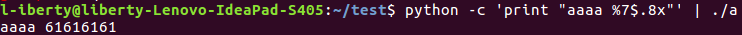
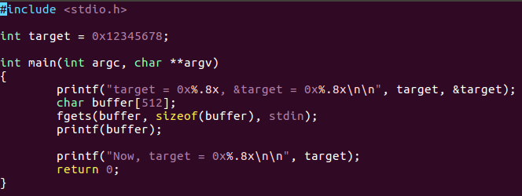
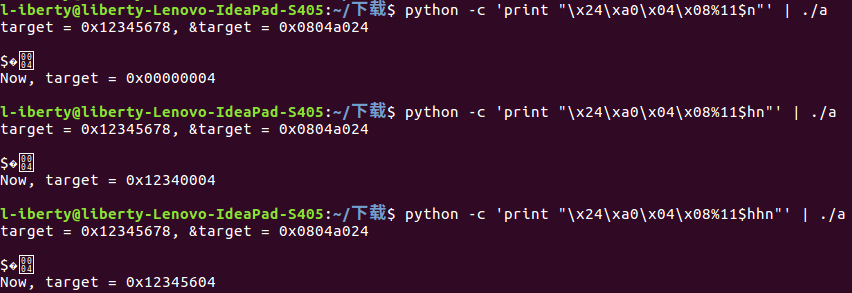
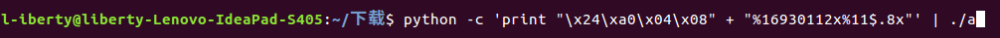
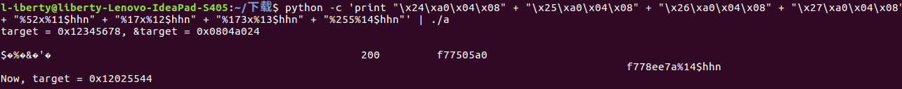
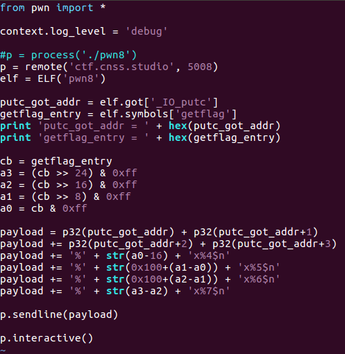
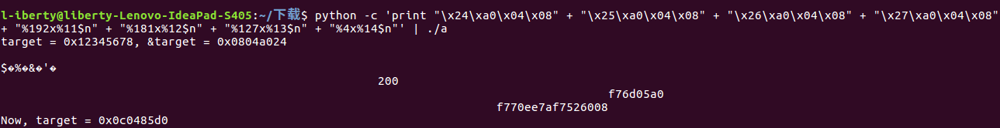

# PWN (8)
> 利用`printf`格式化字符串的漏洞

## printf 漏洞说明
> 漏洞原理网上资料说得很多了，这里只给出操作实例

### 实验一: 读内存

显示的'a'的ASCII码不连续，经测试发现，原因是buffer的长度为奇数. 修改为256后测试输出:

输出显示，存储'aaaa'的**ACSII码**的内存单元与存储'aaaa'的**地址**的内存单元的偏移为7单位. 结合gdb调试信息验证:

0xffffcecc-0xffffced0=0x1c，0x1c / 4 = 7.

得到了偏移单位后，可以直接读取:

### 实验二: 写内存
#### 任务一：测试

下图为以4字节，2字节，1字节为单位的写入：

字节值存储在偏移为11单位处:

`%11$n` 表示: 以偏移11单位内存区内的4字节数值作为内存地址，向该内存地址指向的内存单元写入4字节的整数，数值等于`printf`打印的字符数.

#### 任务二：向指定内存单元写入指定值 0x01025544
##### 法一：直接让`printf`打印0x01025544个字符

测试发现，`printf`打印的字符数庞大，需要等待很长时间. 可见，此法理论上可行但实际操作性很差.

#### 法二：将0x01025544拆分为4个1字节的数0x01,0x02,0x55,0x44，分别写入

将`target`分解成的4个1字节数按照所处内存区的地址由高到低编号为a3,a2,a1,a0，根据小端序，对应关系为 a3-0x44, a2-0x55，a1-0x02，a0-0x01.

* `0x0804a024`为`a0`的地址，存储在偏移**11**单位处，需向地址为`0x0804a024`的内存区写入`0x44`，为此需令`printf`在`%11$hhn`之前打印`0x44`个字符. 已经打印了`16`个字符，还需**0x44 - 16 = 0x52**.
* `0x0804a025`为`a1`的地址，存储在偏移**12**单位处，需向地址为`0x0804a025`的内存区写入`0x55`，为此需令`printf`在`%12$hhn`之前打印`0x55`个字符. 已经打印了`16 + 0x52 = 0x44`个字符，还需**0x55 - 0x44 = 0x11 = 17**.
* `0x0804a026`为`a2`的地址，存储在偏移**13**单位处，需向地址为`0x0804a026`的内存区写入`0x02`，为此需令`printf`在`%13$hhn`之前打印`0x02`个字符. 已经打印了`0x55`个字符，还需**0x02 - 0x55 = -83**. 处理负数的方法是向更高位借一：**0x100 + (-83) = 173**.
* `0x0804a027`为`a3`的地址，存储在偏移**14**单位处，需向地址为`0x0804a027`的内存区写入`0x01`，为此需令`printf`在`%14$hhn`之前打印`0x01`个字符. 已经打印了`0x01`个字符，还需**0x01 - 0x02 = -1**. 向高位借一: **0x100 + (-1) = 255**.

**至此，实现了借助`printf`向任意内存区写入**

## IDA分析二进制文件
`main:`

`getflag:`

### 思路
借助`printf`的漏洞，覆盖`_IO_putc`在GOT表中的入口地址为`getflag`的入口地址，将`_IO_putc`的调用跳转到`getflag`

### exp

测试后失败. 部分输出如下:

借助 实验二-任务二 里使用的程序来查看是否向地址为`0x804a014`的内存单元写入了`0x80485d0`:

最高位字节写入错误. 经过反复的猜测和实验，得出正确的结果(但错误的原因我不明白):

修改payload:

执行后成功拿到shell:

