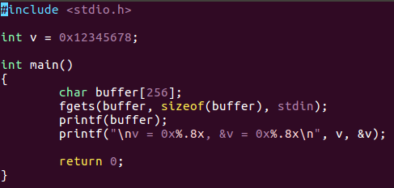
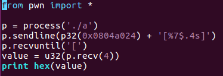
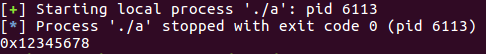
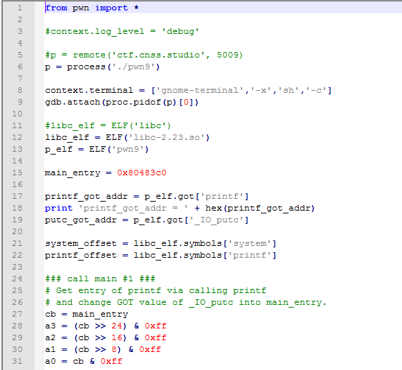
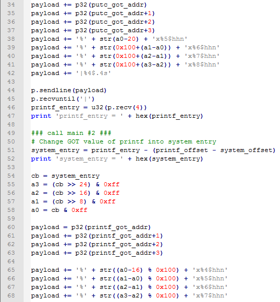
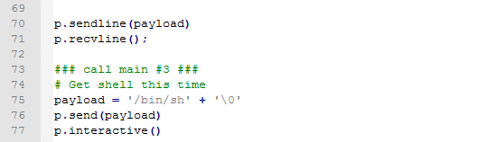
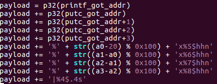
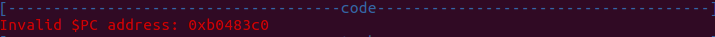
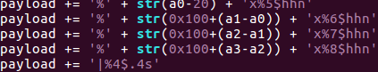

# PWN (9)
> 本题main函数代码与pwn8一样，但是没有提供`getflag`，需要自行构造`system(“/bin/sh”)`的调用

## 预备知识
pwn8笔记中提到的`读内存`实验中，只实现了根据偏移量实现内存读取，未能实现任意地址的内存读取.
### 实验：任意地址的内存读取

需要读取变量`v`的值.

运行:

`0x0804a024`是全局变量`v`的地址，结果显示，成功读取到该地址处的内容. **原理**是字符串的存取规则: 字符串的ASCII码存放在起始地址为`addr`的内存区，在另一个4字节(32位环境)内存单元`x`存放内存地址`addr`，以`%s`读取内存单元`x`时将返回地址`addr`处的内容，直至`'\x00'`. 如果`x`中的地址为某个函数的GOT表地址，以`%4.s`读取便可获得该函数的入口地址.

## 思路
* 借助`printf`的漏洞，根据GOT表获取`printf`的入口地址，用于后续获取`system`的入口地址；同时将`_IO_putc`的入口地址修改为`main`函数入口，从而再次获得利用`printf`漏洞的机会
* 在第二次进入`main`函数后，将`printf`的入口修改为`system`的入口. (本次调用`_IO_putc`时将再次跳回`main`的开始)
* 第三次进入`main`，发送`/bin/sh`，由于之前`printf`的入口已被改为`system`的入口，`printf("/bin/sh")`将被替换为`system("/bin/sh")`，从而获得shell

## python脚本

## More
将 `_IO_putc`入口修改为`main`函数入口时，构造payload时发生了诡异的事情.

最初的payload:

调试时发现，写入出错:

借助pwn8中的c程序`a`和python脚本`b.py`，得出正确的payload:

