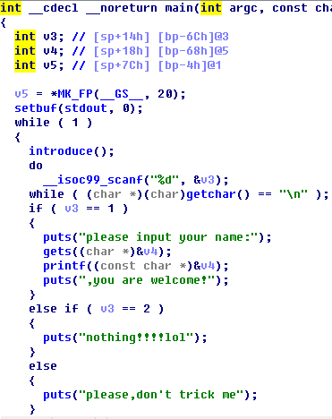

# pwn (10)
本题依然是对`printf`的漏洞利用，但却有一些值得关注的细节

## 反编译分析

其中`introduce`函数打印几行字符串，前几次用`puts`，最后一次用`printf`.

## 思路
* 第一步，借助`printf`获取某个库函数的入口地址，借此计算出`system`的入口；
* 第二步，再次利用`printf`，把`printf`在GOT表中存放着的入口地址替换为`system`的入口
* 第三步，发送'/bin/sh'，将main函数里`printf("/bin/sh")`的调用将变为`system("/bin/sh")`，拿到shell.

在进行第三步时，由于`introduce`函数里存在固定字符串参数的`printf`调用，因此`printf`被替换后会出现`sh: command not found`之类的错误，但并不影响后面main函数里构造好的`system("/bin/sh")`的调用.**但是**,这只是理想情况! 我在使用自行构造的payload时，最终因为`sh: command not found`错误，进程直接终止. 后来使用`fmtstr_payload`函数构造payload则可以成功，不过并不是每次都能成功.

## 总结
* 利用格式化字符串漏洞时一律使用`fmtstr_payload`函数构造payload，避免调错的大量开销
* gdb调试命令`finish`，作用是跳出函数