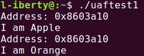
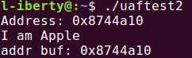
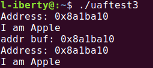
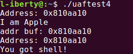
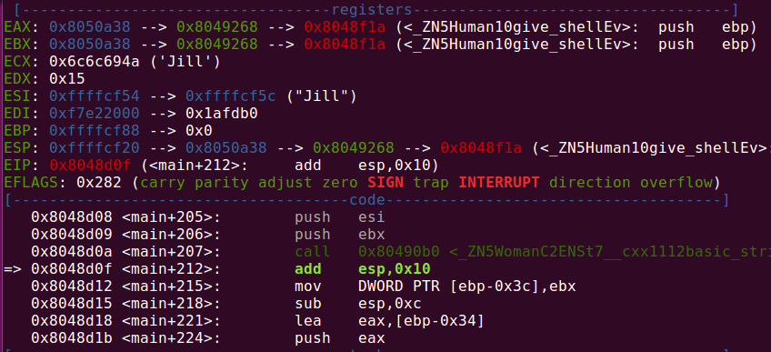
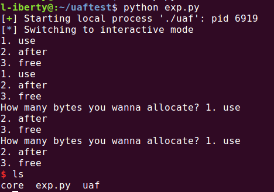

# UAF

## 通过实验来说明UAF原理

### uaftest1.cpp

```
#include <stdio.h>
#include <stdlib.h>

class Fruit
{
private:
	virtual void give_shell()
	{
		printf("You got shell!\n");
	}
public:
	virtual void printMe()
	{
		printf("I am Fruit\n");
	}
};

class Apple: public Fruit
{
public:
	void printMe()
	{
		printf("I am Apple\n");
	}
};

class Orange: public Fruit
{
public:
	void printMe()
	{
		printf("I am Orange\n");
	}
};

void handleObj(Fruit* fruit)
{
	printf("Address: %p\n", fruit);
	fruit->printMe();
}

int main(int argc, char const *argv[])
{
	Fruit* apple = new Apple();
	handleObj(apple);
	delete apple;

	Fruit* orange = new Orange();
	handleObj(apple);
	delete orange;

	return 0;
}
```

main函数里首先new了一个Apple，随后delete释放内存；接着new了一个Orange，但之后传递给`handleObj`的参数却是`apple`，然而`apple`指向的内存已经被释放，测试结果却显示：



由此可知，`apple`指向的内存被释放后，`Orange`对象被分配到了那里，此时的`apple`实则成为了指向`Orange`对象的指针，因此`handleObj(apple)`产生了同`handleObj(orange)`一样的输出. 但是为什么，或者说怎样，才能使两次内存分配时分配到同一地址?

### uaftest2.cpp
**指针指向的内存被释放后，再次申请相同大小的内存时，系统会在之前的释放地址上分配以提高系统运行速度.** 注意到`Fruit`, `Apple`和`Orange`均不含成员变量，仅包含虚函数，所以他们都有**4**字节的虚表指针.

```
int main(int argc, char const *argv[])
{
	Fruit* apple = new Apple();
	handleObj(apple);
	delete apple;

	char* buf = new char[4];
	printf("addr buf: %p\n", buf);
	delete buf;

	return 0;
}
```



所以，只要两次分配的内存大小一致，就能分配到同一地址.

### uaftest3.cpp

```
int main(int argc, char const *argv[])
{
	Fruit* apple = new Apple();
	handleObj(apple);
	int vfp = *(int*)apple;
	delete apple;

	char* buf = new char[4];
	printf("addr buf: %p\n", buf);
	*(int*)buf = vfp;
	handleObj(apple);
	delete buf;

	return 0;
}
```

这次把虚表指针的地址`vfp`填入`buf`，从前面的实验可知，最后一次调用`handleObj(apple)`时，`buf`和`apple`指向同一块内存. 也就是说，向`buf`填入虚表地址后相当于重建了之前`apple`指向的`Apple`对象，测试结果也证明了这一点:



### uaftest4.cpp
现在尝试通过虚表机制调用到基类`Fruit`的私有虚函数`give_shell`. 在VS中我通过反汇编分析得出如下结论：*如果一个类有虚函数，那么类的内存块的开头4字节是虚表地址，假设为x; 虚表中存放着虚函数的入口地址，如果有f1,f2,f3三个虚函数，他们的入口地址在虚表中顺序排放，调用f1,f2,f3的指令为`call [x], call [x+4], call [x+8]`.* 基于上述结论，根据类的结构，我得出调用`give_shell`的代码:

```
int main(int argc, char const *argv[])
{
	Fruit* apple = new Apple();
	handleObj(apple);
	int vfp = *(int*)apple;
	delete apple;

	char* buf = new char[4];
	printf("addr buf: %p\n", buf);
	*(int*)buf = vfp - 4;
	handleObj(apple);
	delete buf;

	return 0;
}
```

测试结果:



## 实验结束，解题
### 题目源码:
[uaf.cpp](uaf.cpp)

### 思路：
- 首先输入‘3’delete掉两个对象
- 输入‘2’完成内存分配，通过将`data`的开头4字节填充为(虚表地址-4)以重建对象. **特别注意:** 需要分配两次，第一次填充`w`指向的内存，第二次填充`m`指向的内存
- 输入‘1’，`introduce`的执行将被转移到基类的`give_shell`

### 需要解决的问题:
- 对象有多少字节？
> 可以跟踪调试，定位到new，前面push进去的就是对象的内存大小；也可以手算，对于`string`类型, 通过`sizeof(string)`得出其大小为24字节
- 虚表地址怎么得到？
> gdb调试时会有很多提示的：



> 0x8049268即虚表地址，而0x8050a38是`Woman`对象的地址，我曾混淆了他们. 此外可以看到`give_shell`是虚表里的第一个函数

### exp虽然短小，但来之不易:
[exp.py](exp.py)

### 测试成功：
