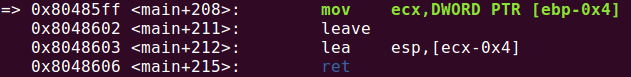
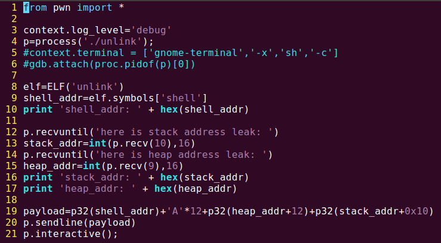
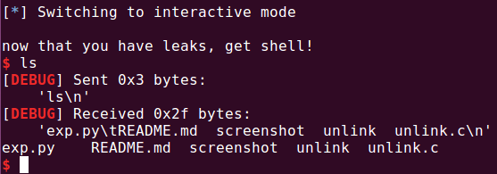

# unlink(堆溢出)

## 题目源码：

```
#include <stdio.h>
#include <stdlib.h>
#include <string.h>
typedef struct tagOBJ{
	struct tagOBJ* fd;
	struct tagOBJ* bk;
	char buf[8];
}OBJ;

void shell(){
	system("/bin/sh");
}

void unlink(OBJ* P){
	OBJ* BK;
	OBJ* FD;
	BK=P->bk;
	FD=P->fd;
	FD->bk=BK;
	BK->fd=FD;
}
int main(int argc, char* argv[]){
	malloc(1024);
	OBJ* A = (OBJ*)malloc(sizeof(OBJ));
	OBJ* B = (OBJ*)malloc(sizeof(OBJ));
	OBJ* C = (OBJ*)malloc(sizeof(OBJ));

	// double linked list: A <-> B <-> C
	// 构建双向链表
	A->fd = B;
	B->bk = A;
	B->fd = C;
	C->bk = B;

	printf("here is stack address leak: %p\n", &A);
	printf("here is heap address leak: %p\n", A);
	printf("now that you have leaks, get shell!\n");
	// heap overflow!
	gets(A->buf);

	// exploit this unlink!
	unlink(B);
	return 0;
}
```
## 分析，思路
`unlink(B)`相当于
```
(B->fd)->bk=B->bk;
(B->bk)->fd=B->fd;
```
进一步等价为
```
*(*B+4)=*(B+4);
*(*(B+4))=*B;
```
如果B的fd,bk的**值**分别为x,y，则相当于
```
mov [x+4],y
mov [y],x
```
所以`unlink`是实现任意内存读写的关键. 我们的目标是跳转到`shell`. 注意到自`unlink(B)`调用开始，可用的转移指令有`unlink`结尾处和`main`结尾处的两个ret，若要通过ret实现转移则需修改`unlink`函数或`main`函数的栈，从而操纵ret的转移方向为`shell`. 本题提供了`main`函数的局部变量`A`的地址，因此操纵`main`函数的栈要容易些.

## 解决方案-1
假设`main`函数的返回地址所在栈单元的地址为`target_addr`，`shell`函数入口地址为`shell_addr`，我的目标是：修改地址为`target_addr`的内存里的内容为`shell_addr`，现在有两种方案：<1>令 y=shell_addr,x+4=target_addr, 那么`mov [x+4],y`可以达到目的，但紧随其后的`mov [y],x`将导致两种可能结果：要么因内存不可写而引发异常；要么写入成功，但这样以来，`shell`的代码被将篡改；<2>令 y=target_addr,x=shell_addr, 但同样面临之前的问题. 经调试证实，引发异常的原因是`shell`代码段所在内存不可写. 回顾上述方案，我发现题目提供的堆地址我没使用，计算`target_addr`只需要栈地址.

## 解决方案-2
`main`函数结尾处：



如果令[ecx-0x4]=`shell_addr`，通过ret就能跳转成功. 其中的关键指令相当于`lea esp,[[ebp-0x4]-0x4]`，只需使得此时的[ebp-0x4]=存放`shell_addr`的内存单元的地址+0x4.

由动态调试可知，stack_addr=ebp-0x14，所以应向`stack_addr+0x10`指向的内存填入*存放`shell_addr`的内存单元的地址+0x4*. 若令 y=stack_addr+0x10, x=存放`shell_addr`的内存单元的地址+0x4, 就能通过`mov [y],x`达成目的；而前面的`mov [x+4],y`属于多余操作，当且仅当x是一个"安全"的地址值.

`payload=p32(shell_addr)+'A'*12+p32(heap_addr+12)+p32(stack_addr+0x10)`

payload从`A->buf`(即`heap_addr+4`)开始填充，shell_addr位于`heap_addr+8`，则x的值满足要求.

## exp



## result




